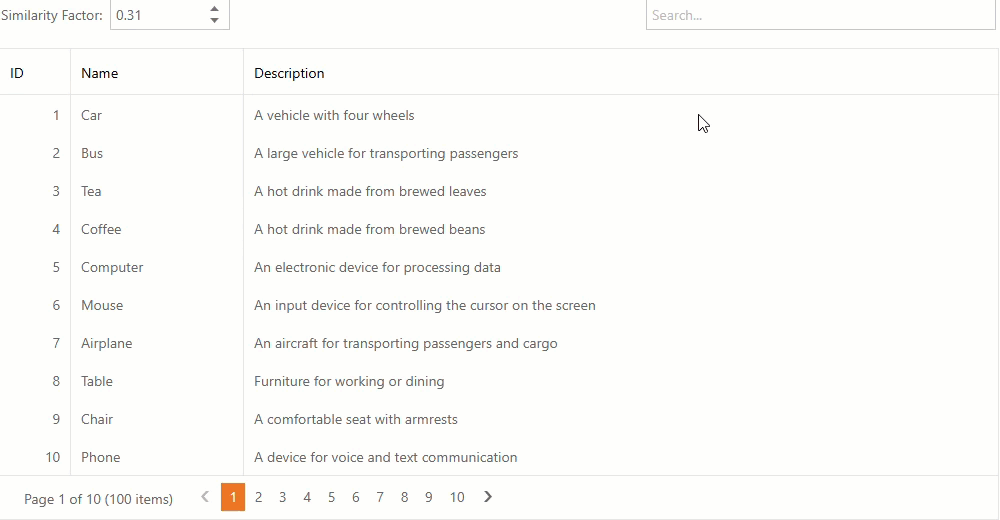

<!-- default badges list -->
[](https://supportcenter.devexpress.com/ticket/details/T1313990)
[](https://docs.devexpress.com/GeneralInformation/403183)
[](#does-this-example-address-your-development-requirementsobjectives)
<!-- default badges end -->
# ASP.NET Web Forms Grid View - Semantic Search

This example incorporates AI-powered semantic search into ASP.NET Web Forms [Grid View](https://docs.devexpress.com/AspNet/DevExpress.Web.ASPxGridView). Unlike traditional keyword matching, semantic search leverages Natural Language Processing (NLP) to understand the intent behind a query and deliver more relevant answers.



## Register an AI Service

To run this example, configure project dependencies and set up secure authentication for the desired AI service.

> [!NOTE]
> DevExpress AI-powered extensions follow the "bring your own key" principle. DevExpress does not offer a REST API and does not ship any built-in LLMs/SLMs. You need an active Azure/Open AI subscription to obtain the REST API endpoint, key, and model deployment name. These variables must be specified at application startup to register AI clients and enable DevExpress AI-powered Extensions in your application.

This example uses the [Azure OpenAI](https://azure.microsoft.com/en-us/products/ai-foundry/models/openai/) service. For security, secrets are stored in the following environment variables:

- `AZURE_OPENAI_ENDPOINT`: Your Azure OpenAI endpoint
- `AZURE_OPENAI_API_KEY`: Your Azure OpenAI key

In addition, your Azure OpenAI subscription must have deployment for the **text-embedding-3-small** embeddings model for vector search and similarity.

## Implementation Details

### Initialize AI Services

At [startup](CS/Global.asax.cs), the application instantiates an [Azure OpenAI](https://azure.microsoft.com/en-us/products/ai-foundry/models/openai/) embedding generator (**text-embedding-3-small**) and stores it in the Application state for reuse throughout the app lifecycle.

The embedding generator is a specialized AI model that translates text into a list of numbers called a _vector_. Its primary purpose is to mathematically compare the meaning of data rather than just matching literal keywords.

```csharp
var credentials = new ApiKeyCredential(azureOpenAIKey);
var openAI = new AzureOpenAIClient(
    new Uri(azureOpenAIEndpoint),
    credentials
);

var embeddingGenerator = openAI
    .GetEmbeddingClient("text-embedding-3-small")
    .AsIEmbeddingGenerator();

Application["EmbeddingGenerator"] = embeddingGenerator;
```

It is also possible to use a different Azure OpenAI embeddings deployment. Change the model name in `GetEmbeddingClient(...)` to match your deployment.

### Implement a Smart Filter Provider

The `SmartFilterProvider` [class](CS/SmartFilterProvider.cs) manages embedding generation and similarity calculations.

- `SmartFilterProvider` constructor: Stores the [embedding generator](https://learn.microsoft.com/en-us/dotnet/api/microsoft.extensions.ai.iembeddinggenerator) instance for later use.
- `FillCache`: Normalizes and de-duplicates user input. It implements static caching to prevent redundant generation of embeddings for the same text.
- `GetSimilarity`: Looks up cached embeddings for two strings and returns how close they are by [cosine similarity](https://learn.microsoft.com/en-us/dotnet/api/system.numerics.tensors.tensorprimitives.cosinesimilarity). Returns a value between `-1` and `1`, where values closer to `1` indicate higher similarity.

### Create a Semantic Search UI

The [WebForm1.aspx](CS/WebForm1.aspx) page features a [grid control](https://docs.devexpress.com/AspNet/DevExpress.Web.ASPxGridView) populated with sample data. This data is generated in [WebForm1.aspx.cs](CS/WebForm1.aspx.cs) by the `GenerateData()` method as an in-memory `List<DictionaryEntry>`.

Users can perform semantic searches using two controls located in the [grid toolbar](https://docs.devexpress.com/AspNet/118563/components/grid-view/concepts/toolbars):

- [ASPxTextBox](https://docs.devexpress.com/AspNet/DevExpress.Web.ASPxTextBox): Allows users to enter search queries.
- [ASPxSpinEdit](https://docs.devexpress.com/AspNet/DevExpress.Web.ASPxSpinEdit): Adjusts the similarity threshold.

These controls trigger the `onSearchChanged` JavaScript function when their values change:

```javascript
function onSearchChanged(s, e) {
    const text = searchBox.GetText();
    const sim = similaritySpin.GetValue();
    grid.PerformCallback(JSON.stringify({ search: text, similarity: sim }));
}
```

This function sends a JSON payload with the search text and similarity threshold to the server via the grid's `PerformCallback` method.

### Implement Server-Side Semantic Search

[WebForm1.aspx.cs](CS/WebForm1.aspx.cs) initializes the data source and handles semantic search requests in the `CustomCallback` event:

1. Deserializes the callback payload to get the search text and similarity threshold.
2. Combines each item's `Name` and `Description` for semantic matching.
3. Generates embeddings for all texts and caches them in the `SmartFilterProvider`.
4. Computes cosine similarity between each item and the query.
5. Filters items where similarity is greater than the threshold.
6. Orders results by similarity (most relevant first).
7. Updates the grid data source with filtered results.

## Run the Solution

Press <kbd>F5</kbd> to run the application. The browser will open to display the grid and search toolbar. If you encounter an _HTTP Error 403.14 - Forbidden_, append `/WebForm1.aspx` to the URL.

- Enter a query and press <kbd>Enter</kbd> to perform a semantic search.
- Change **Similarity Factor** to refine your search:
    - Move toward _1_ (strict) for exact matches only. You will only see results that mean almost exactly what you typed.
    - Move toward _0_ (loose) to explore more options, even if they use different words.

The grid refreshes automatically with filtered, ranked results.

## Files to Review

- [Global.asax.cs](CS/Global.asax.cs)
- [SmartFilterProvider.cs](CS/SmartFilterProvider.cs)
- [WebForm1.aspx](CS/WebForm1.aspx)
- [WebForm1.aspx.cs](CS/WebForm1.aspx.cs)

## Documentation

- [AI Integration](https://docs.devexpress.com/CoreLibraries/405204/ai-powered-extensions)
- [Grid View](https://docs.devexpress.com/AspNet/5823/components/grid-view)
- [Text Box](https://docs.devexpress.com/AspNet/11586/components/data-editors/textbox)
- [Spin Editor](https://docs.devexpress.com/AspNet/11664/components/data-editors/spinedit)

<!-- feedback -->
## Does This Example Address Your Development Requirements/Objectives?

[](https://www.devexpress.com/support/examples/survey.xml?utm_source=github&utm_campaign=draft-how-to-integrate-AI-in-ASPxGridView&~~~was_helpful=yes) [](https://www.devexpress.com/support/examples/survey.xml?utm_source=github&utm_campaign=draft-how-to-integrate-AI-in-ASPxGridView&~~~was_helpful=no)

(you will be redirected to DevExpress.com to submit your response)
<!-- feedback end -->
